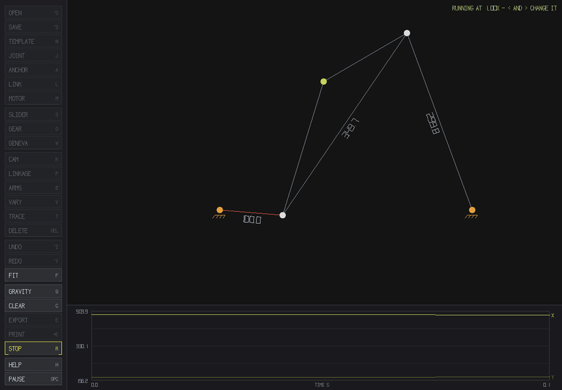
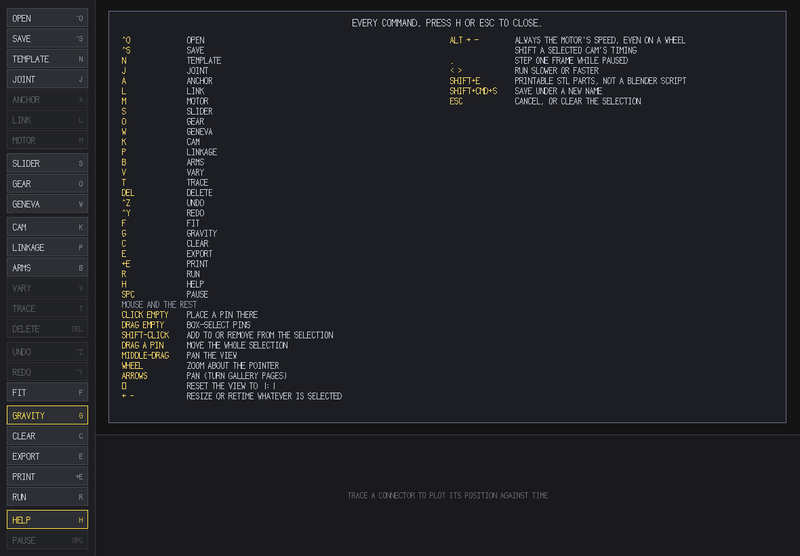
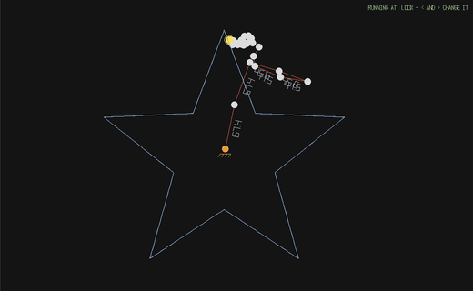
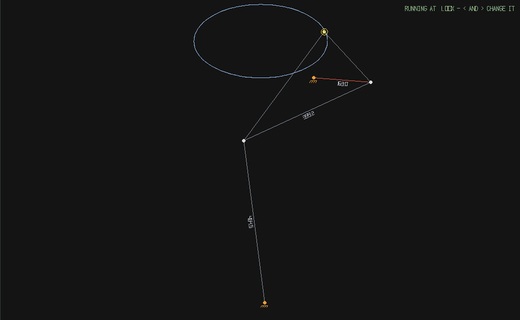
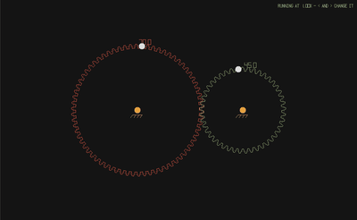
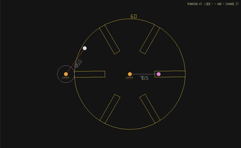
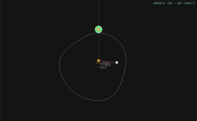
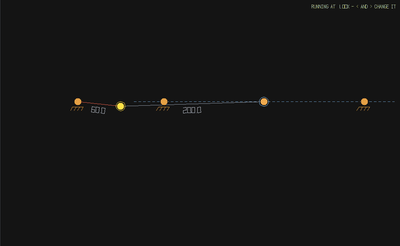
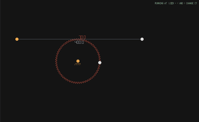
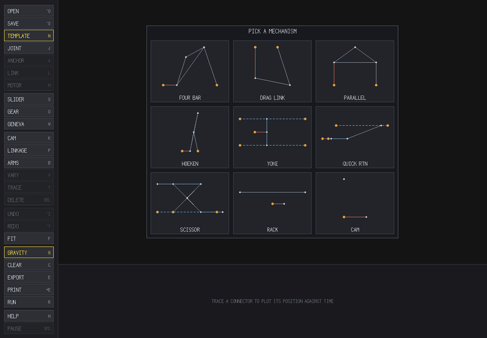

# Linkage Design

A small desktop workshop for planar mechanisms.

Build a machine out of pins, links, sliders, gears, cams and Geneva wheels,
give it a motor, and watch it run. Or work the other way round: draw the path
you want a point to follow, and let the program design the machine that traces
it. When you like what you've got, take it away as a Blender animation or as a
folder of printable STL parts that bolt together.

<p align="center">
  
</p>

## Getting it running

You'll need SDL2 — `brew install sdl2` on macOS, `apt install libsdl2-dev` on
Debian or Ubuntu. It runs on macOS and Linux; the STL export uses POSIX
directory calls, so on Windows you'd want MSYS2 or WSL.

```
make          # builds ./linkage_design
make test     # runs the headless kinematics tests, if you're curious
./linkage_design
```

## Try this first

Press `N`, click any mechanism in the gallery, and press `R`. That's a working
machine on screen in about five seconds. From there, drag a pin and watch the
shape change, or press `B` and scribble a loop with the mouse — the program
will build something that redraws your scribble.

Nothing you press is destructive, `Cmd/Ctrl+Z` undoes everything, and you can't
break it by poking at it.

## You don't have to memorise anything

`H` shows every key inside the window. Every command is also a button down the
left edge with its shortcut printed on it, and buttons grey out when they don't
apply — hover one and it tells you what it wants selected first. Whatever the
program has to say, it says on the canvas.

<p align="center">
  
</p>

## Draw a path, get a machine

Draw a curve and the program designs something to trace it. `P` fits a
**four-bar** — five parts and one motor, though only the curves a four-bar can
manage. `B` builds a **chain of rotating arms**, which will redraw absolutely
anything, at the cost of dozens of parts. Either way you get a complete,
running mechanism you can then take apart.

<table>
<tr>
<td width="50%"></td>
<td width="50%"></td>
</tr>
<tr>
<td align="center"><code>B</code> — arms redrawing a star</td>
<td align="center"><code>P</code> — a four-bar fitted to an oval</td>
</tr>
</table>

## Joints beyond the pin

Press one of these with nothing selected and a whole working assembly appears,
ready to run — you don't need to know what to arrange first. Press it with the
right parts selected and it joins those instead.

<table>
<tr>
<td width="50%"></td>
<td width="50%"></td>
</tr>
<tr>
<td align="center"><code>O</code> — gears, meshed on a real tooth grid</td>
<td align="center"><code>W</code> — a Geneva wheel, indexing</td>
</tr>
<tr>
<td width="50%"></td>
<td width="50%"></td>
</tr>
<tr>
<td align="center"><code>K</code> — draw a cam, get a follower</td>
<td align="center"><code>S</code> — sliders and pins in slots</td>
</tr>
</table>

<p align="center">
  
  <br><em>a rack and pinion — the teeth you see are the teeth that get printed</em>
</p>

## Or start from a famous one and take it apart

`N` opens the gallery. Everything in it is made of the same pins and bars you
draw by hand, so any of it can be pulled apart, retimed and rebuilt. It's a
good way to see how something works.

<p align="center">
  
</p>

## Rigid means rigid

A fixed-length link never stretches. If the motor would have to stretch one to
keep turning, the mechanism **jams and tells you so**, which is what the real
one would do — a jam is a finding, not a bug. If you'd rather a link could give,
`V` marks it as free to change length.

## Taking it with you

`E` writes a ready-to-run Blender script with the animation baked in.
`Shift+E` writes a folder of **printable STL parts**: gears with a whole number
of involute teeth, plates with pin holes, a baseplate, the pins to join them,
and two views of the whole thing assembled so you can see what goes where.
Parts that share a pin are stacked on separate layers, so nothing prints into
anything else.

## Going deeper

[**docs/manual.md**](docs/manual.md) is the full reference: every joint and
what it wants selected, designing from a path, cams and followers, lock-up,
saving, the Blender export, printing (tooth counts, layers, watertightness),
and how the solver works underneath.

## About the pictures

None of them are screenshots — they come out of the program itself:

```
make docs-images    # needs ffmpeg
```

which runs `./linkage_design --capture <subject> <frames> <dir>` to render
frames offscreen through the real drawing code, then encodes them. So they
can't drift from what the program actually draws.

## Contributing

It's a hobby project, and issues and pull requests are welcome. `make test`
should stay green — it's headless, so it needs no display — and the build is
`-Werror` on both macOS and Linux, which CI checks on every push.

## License

MIT — see [LICENSE](LICENSE). Do what you like with it.
