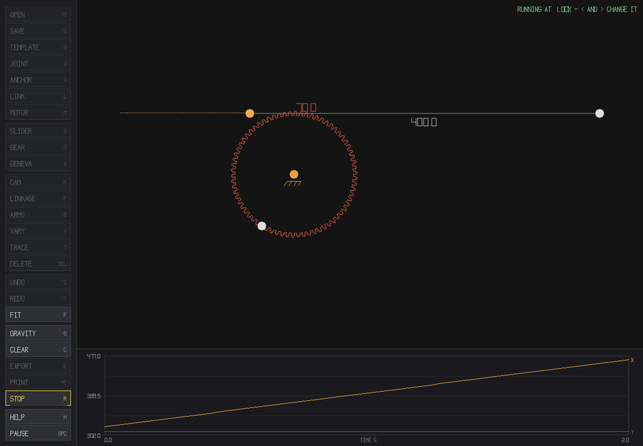
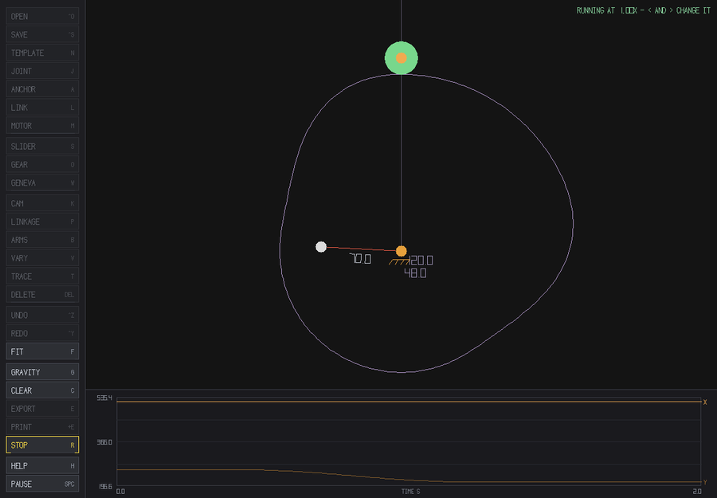

# Linkage Design

A 2D mechanism editor and simulator. Build a planar mechanism out of pins,
anchors, rigid links, sliders, gears, racks, cams and Geneva wheels, drive it
with a motor, and watch it move — or draw the path you want a point to follow
and let the program design a machine that traces it. When it works, export it
as a Blender animation or as a folder of printable STL parts that bolt
together.


- **Everything is editable.** Templates and generated linkages are made of the
  same pins and bars you draw by hand, so you can take any of them apart.
- **Rigid means rigid.** A fixed-length link never stretches: if the motor
  would have to stretch one to keep turning, the mechanism jams and says so,
  which is what a real one would do.
- **Joints beyond the pin.** Sliders and pins-in-slots, meshed gear pairs,
  racks and pinions, drawn disc cams with roller followers, Geneva wheels.
- **Design from a path.** Draw a curve: `P` fits a four-bar to it, `B` builds
  a chain of rotating arms that redraws *anything* you can draw.
- **It comes out as real parts.** Gears are exported with a whole number of
  involute teeth, plates get pin holes, and parts sharing a pin are stacked on
  separate layers so nothing prints into anything else.

## Build

Requires SDL2 (`brew install sdl2` on macOS, `apt install libsdl2-dev` on
Debian/Ubuntu). macOS and Linux only — the STL export uses POSIX directory
calls, so Windows needs MSYS2/Cygwin or WSL.

```
make        # builds ./linkage_design
make test   # builds and runs the headless kinematics regression tests
```

## Run

```
./linkage_design
```

**`H` lists every key inside the window** — there is nothing you have to read
here first. Every command is also a button down the left edge with its
shortcut on it; buttons grey out when they don't apply and say what they want
selected first, and everything the program has to say appears on the canvas.

| Key | |
|---|---|
| `N` | template gallery — famous mechanisms, running and ready |
| click / `J` | place a pin; `L` links the selected pins, `A` grounds them |
| `M` | make the selected link a motor (`+`/`-` for its speed) |
| `S` `O` `W` `K` | slider, gear, Geneva wheel, cam |
| `P` `B` | draw a path: fit a four-bar to it / build a chain of arms |
| `T` | trace a pin's path, and plot its x and y against time |
| `R` | run / stop. Space pauses, `.` steps one frame, `<` `>` change speed |
| `G` | gravity. `V` lets a link's length vary. `F` fits the view |
| `E` / `Shift+E` | export to Blender / write a folder of printable STL parts |
| Cmd/Ctrl+`S` `O` `Z` | save, open, undo |

<p align="center">
  
  
</p>

## The manual

[**docs/manual.md**](docs/manual.md) covers all of it: the joints and what
each one wants selected, the template gallery, designing from a path, cams and
followers, lock-up, saving, the Blender export, printing (tooth counts,
layers, watertightness), and how the solver works.

## Tests

```
make test
```

A headless regression suite — no window, no display needed — covering the
kinematics, the synthesis, the gear geometry, the save/load round trip and the
printability of every exported part.

## The pictures in this README

They are generated by the program, not taken by hand:

```
make docs-images    # needs ffmpeg
```

which runs `./linkage_design --capture <template> <frames> <dir>` to render
frames offscreen through the real drawing code, then encodes them.

## License

MIT — see [LICENSE](LICENSE).
